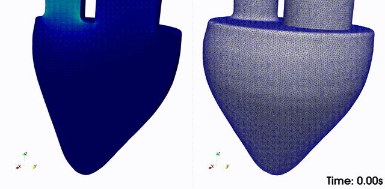

## OasisMove - Oasis for Moving Domains

[Read Latest Documentation](https://kvslab.github.io/oasismove/)

_________________

    

    Fluid velocity (left) and mesh deformation (right) of an idealized left ventricle. 

Description
-----------
OasisMove is a high-level/high-performance open-source Navier-Stokes solver for fluid flow in rigid and moving domains
written in Python/[FEniCS](https://fenicsproject.org/), and is an extension of the computational fluid dynamics (CFD)
solver [Oasis](https://github.com/mikaem/Oasis). In OasisMove the Navier-Stokes equations are expressed in the
arbitrary Lagrangian-Eulerian formulation, which is suitable for handling moving domains. This moving domain solver has
undergone rigorous verification and validation, and results have shown that OasisMove follows theoretical convergence
rates, begin second order accurate in time, and second and third order accurate in space with P1/P1 and P2/P1 finite
elements. Although OasisMove was developed with cardiovascular flows in mind, it is applicable to several flow problems
within CFD.

    

    Spatial convergence study of OasisMove performed by varying the characteristic edge length Δx. On the left, the L2 error for the
    velocity, and on the right the L2 error for the pressure, both following theoretical convergence rates. 
    The solid lines represent the simulation results, and the dashed lines display the theoretical convergence rates. 
    A similar study was performed to address temporal convergence, resulting in second order convergence (not shown here). 

Authors
-------
OasisMove is developed by

* Henrik Aasen Kjeldsberg

Licence
-------
OasisMove is licensed under the GNU GPL, version 3 or (at your option) any later version.

OasisMove is Copyright (2022) by the author.

Documentation
-------------
For detailed installation notes and an introduction to OasisMove, please refer to
the [documentation](https://oasismove.readthedocs.io/en/latest/). For (outdated) details on vanilla Oasis, please refer
to its [wiki](https://github.com/mikaem/oasis/wiki) or
the [user manual](https://github.com/mikaem/Oasis/tree/master/doc/usermanual.pdf)

If you wish to use OasisMove/Oasis for journal publications, please cite the
following [paper](http://www.sciencedirect.com/science/article/pii/S0010465514003786).

Installation
------------
OasisMove requires a compatible installation of FEniCS, which is available through Anaconda on macOS and Linux. Windows
users may need to install FEniCS as described [here](https://fenicsproject.org/download/). Start by installing
Anaconda/Miniconda on your computer, and add the `conda-forge` channel with:

    conda config --add channels conda-forge
    conda config --set channel_priority strict

Then create a conda environment for `FEniCS` by executing the following command in a terminal

    conda create -n your_environment fenics 

An alternative is to run FEniCS through a [Docker](https://www.docker.com/) image. Next, you need to install OasisMove.
You can do so with the following commands:

    git clone https://github.com/KVSlab/OasisMove
    pip install --editable OasisMove

Now you are all set, and can start running CFD simulations in moving domains with OasisMove.

Issues
------
Please report bugs and other issues through the [issue tracker](https://github.com/KVSlab/OasisMove/issues).

